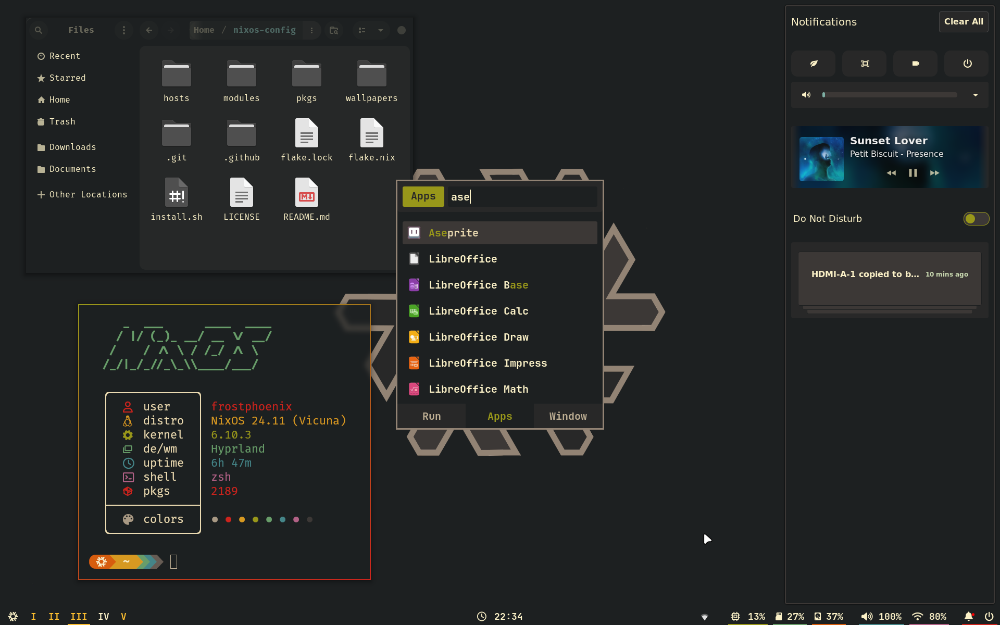
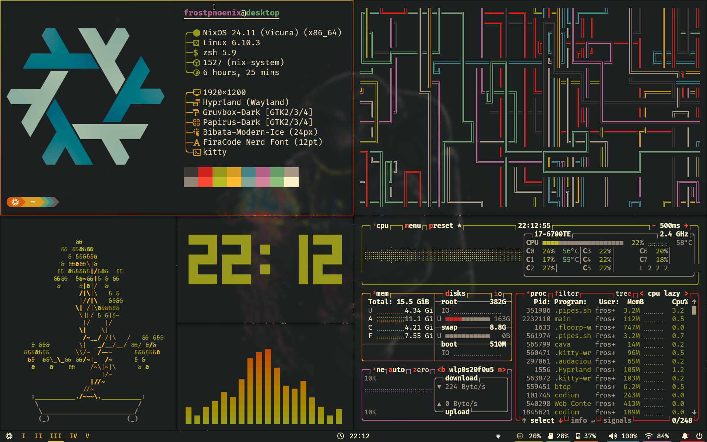
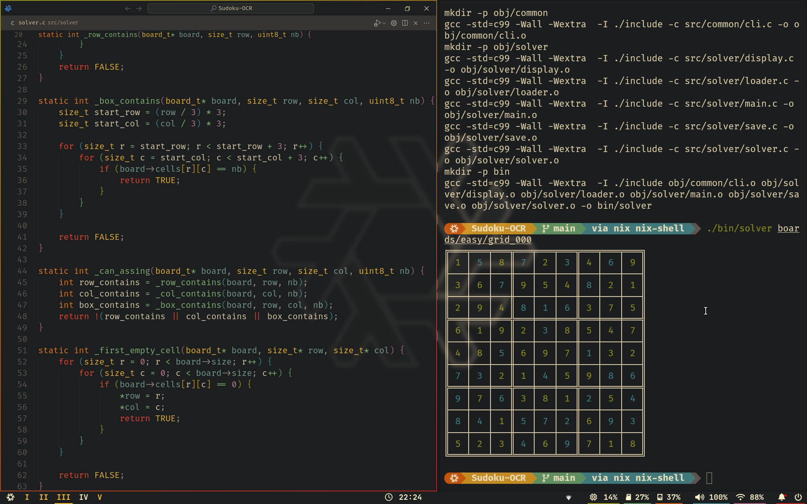

<h1 align="center">
   
   
   <br>
   Roman Vassilchenko's Dotfiles
   <!-- <br>
    -->
</h1>

<div align="center">
   <p></p>
   <!-- <a href="https://github.com/RomanVassilchenko/.dotfiles/stargazers">
      
   </a> -->
   <a href="https://github.com/RomanVassilchenko/.dotfiles/">
      
   </a>
   <a href="https://nixos.org">
      
   </a>
   <a href="https://github.com/RomanVassilchenko/.dotfiles/blob/main/LICENSE">
      
   </a>
</div>

<!-- ### 🖼️ Gallery

<p align="center">
    <br>
    <br>
    <br>
   Screenshots last updated <b>2024-11-02</b>
</p> -->

<!-- --- -->

# 🗃️ Overview

This repository contains my personal dotfiles and configurations for NixOS and macOS (Darwin) systems, using Nix flakes and `home-manager` to ensure a smooth and unified setup across both platforms.

## 📚 Layout

- **flake.nix** - The main entry point for configuration across systems.
- **hosts** - Host-specific configurations for each OS:
  - **NixOS** - Configurations for my NixOS setup.
  - **Darwin** - macOS-specific configurations using `nix-darwin`.
- **modules** - Modular configurations organized by functionality:
  - **core** - Core configurations and settings.
  - **home** - Settings managed through `home-manager`.
  - **darwin** - macOS-specific configurations.
  - **nixos** - NixOS-specific configurations.

---

<!-- ## 📓 Components

| Component                     | NixOS Configuration          | macOS (Darwin) Configuration         |
| ----------------------------- | ---------------------------- | ------------------------------------ |
| **🎛️ Window Manager**         | Hyprland                     | macOS default window manager        |
| **📊 Status Bar**             | Waybar                       | macOS Menu Bar                      |
| **🚀 Application Launcher**   | Rofi                         | Raycast                           |
| **🔔 Notifications**          | Swaync                       | macOS Notification Center           |
| **💻 Terminal**               | Kitty                        | iTerm2 + Kitty                    |
| **🐚 Shell**                  | Zsh + oh-my-zsh + Starship   | Zsh + oh-my-zsh + Starship          |
| **📝 Text Editor**            | Neovim, VSCode               | Neovim, VS Code                     |
| **📈 System Monitor**         | Btop                         | Btop + Activity Monitor                    |
| **📂 File Manager**           | Nemo                         | Finder                              |
| **🔠 Fonts**                  | JetBrainsMono Nerd, CascadiaCode Nerd | Same as NixOS                       |
| **🎨 Theme**                  | Gruvbox Dark Hard            | Gruvbox Dark (in supported apps)    |
| **🖱️ Cursor**                 | Bibata-Modern-Ice            | macOS Default                       |
| **📁 Icons**                  | Papirus-Dark                 | macOS Default                       |
| **🔒 Lockscreen**             | Hyprlock, Swaylock-effects   | macOS Lock Screen                   |
| **🖼️ Image Viewer**           | qview                        | Preview                             |
| **🎶 Music Player**           | Audacious                    | Apple Music, Spotify                |
| **📷 Screenshot Tool**        | Grimblast                    | macOS Screenshot Utility            |
| **📋 Clipboard Manager**      | wl-clip-persist              | macOS Universal Clipboard           |
| **🌈 Color Picker**           | hyprpicker                   | macOS Color Picker                  |

--- -->

## 📝 Shell Aliases

<details>
<summary>
Utility Aliases (Expand)
</summary>

- `c` ➔ `clear`
- `cd` ➔ `z`
- `tt` ➔ `gtrash put`
- `vim` ➔ `nvim`
- `cat` ➔ `bat`
- `nano` ➔ `micro`
- `py` ➔ `python`
- `dsize` ➔ `du -hs`
- `pdf` ➔ `tdf`
- `open` ➔ `xdg-open`
- `space` ➔ `ncdu`
- `man` ➔ `BAT_THEME='default' batman`
- `l` ➔ `eza --icons -a --group-directories-first -1`
- `ll` ➔ `eza --icons -a --group-directories-first -1 --no-user --long`
- `tree` ➔ `eza --icons --tree --group-directories-first`

</details>

<details>
<summary>
NixOS Specific Aliases (Expand)
</summary>

- `cdnix` ➔ `cd ~/.dotfiles && code ~/.dotfiles`
- `ns` ➔ `nom-shell --run zsh`
- `nix-test` ➔ `nh os test`
- `nix-switch` ➔ `nh os switch`
- `nix-update` ➔ `nh os switch --update`
- `nix-clean` ➔ `nh clean all --keep 5`
- `nix-search` ➔ `nh search`

</details>

<details>
<summary>
Git Aliases (Expand)
</summary>

- `g` ➔ `lazygit`
- `gf` ➔ `onefetch --number-of-file-churns 0 --no-color-palette`
- `ga` ➔ `git add`
- `gaa` ➔ `git add --all`
- `gs` ➔ `git status`
- `gb` ➔ `git branch`
- `gm` ➔ `git merge`
- `gd` ➔ `git diff`
- `gpl` ➔ `git pull`
- `gps` ➔ `git push`
- `gc` ➔ `git commit`
- `gcm` ➔ `git commit -m`
- `glol` ➔ `git log --graph`
  
</details>

<!-- ---

## 🛠️ Scripts

All custom scripts are located in `modules/home/scripts/scripts/` and can be accessed as packages in `modules/home/scripts/default.nix`.

<details>
<summary>
toggle_blur.sh
</summary>

**Description:** Toggles the blur effect in Hyprland.

**Usage:** `toggle_blur`
</details>

<details>
<summary>
toggle_opacity.sh
</summary>

**Description:** Adjusts window opacity between two preset levels.

**Usage:** `toggle_opacity`
</details>

<details>
<summary>
compress.sh
</summary>

**Description:** Compresses files/folders into `.tar.gz` format.

**Usage:** `compress <file/folder>`
</details>

--- -->

<!-- ## ⌨️ Keybinds

Press `$mainMod + F1` to view all keybindings. By default, `$mainMod` is the `SUPER` key.

<details>
<summary>
Keybindings
</summary>

- `$mainMod + Return` ➔ Launch Wezterm
- `$mainMod + Space` ➔ Toggle floating window
- `$mainMod + D` ➔ Launch Rofi
- `$mainMod + F` ➔ Toggle fullscreen

</details>

---

# 🚀 Installation

> **CAUTION**: Review configurations and scripts before applying, as custom settings can impact your OS behavior.

## 1. Install Nix

### For NixOS

Use any [graphical ISO image](https://nixos.org/download.html#nixos-iso). Only the Gnome installer (no desktop option) has been tested.

### For macOS (Darwin)

Install `nix-darwin`:

```bash
nix-build https://github.com/LnL7/nix-darwin/archive/master.tar.gz -A installer
./result/bin/darwin-installer
```

## 2. Clone and Apply Configurations

```bash
git clone https://github.com/RomanVassilchenko/.dotfiles
cd ~/.dotfiles
```

### For macOS

```bash
nix build .#darwinConfigurations.mbp-rovasilchenko-OZON-W0HDJTC2M5.system
./result/sw/bin/darwin-rebuild switch --flake .
```

### For NixOS

```bash
sudo nixos-rebuild switch --flake .
```

--- -->

<p align="center"></p>

<div align="right">
  <a href="#readme">Back to the Top</a>
</div>
```
